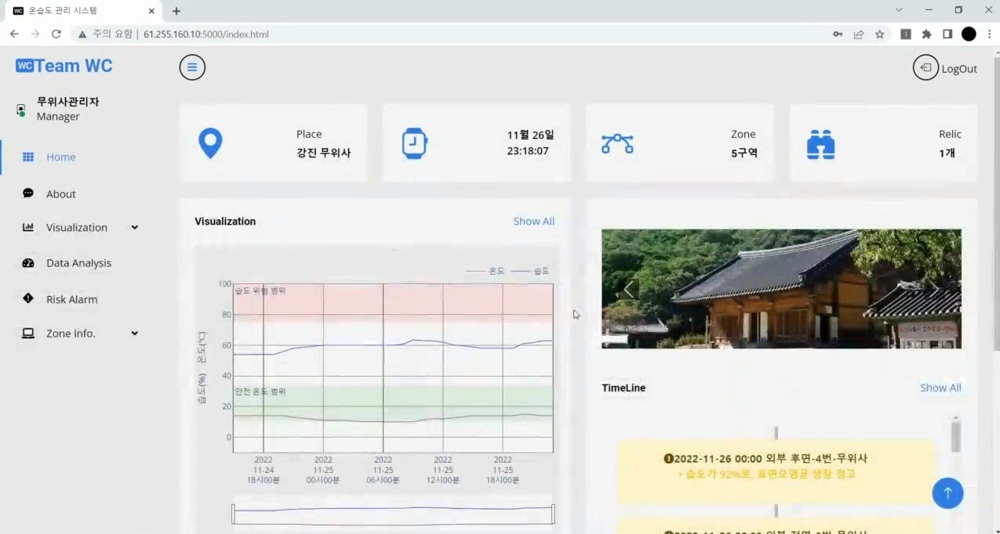
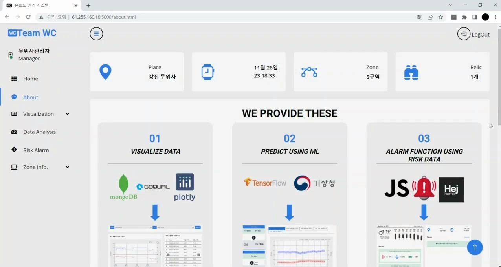
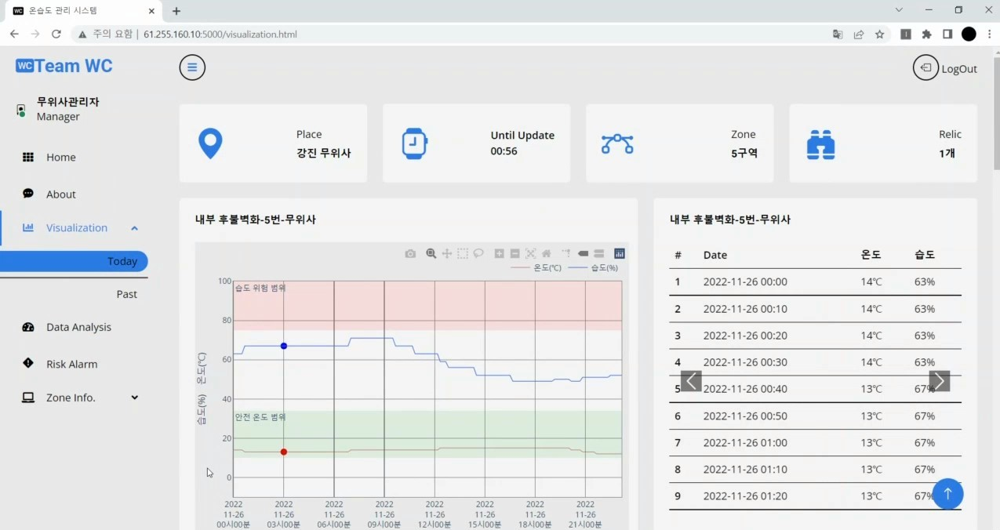
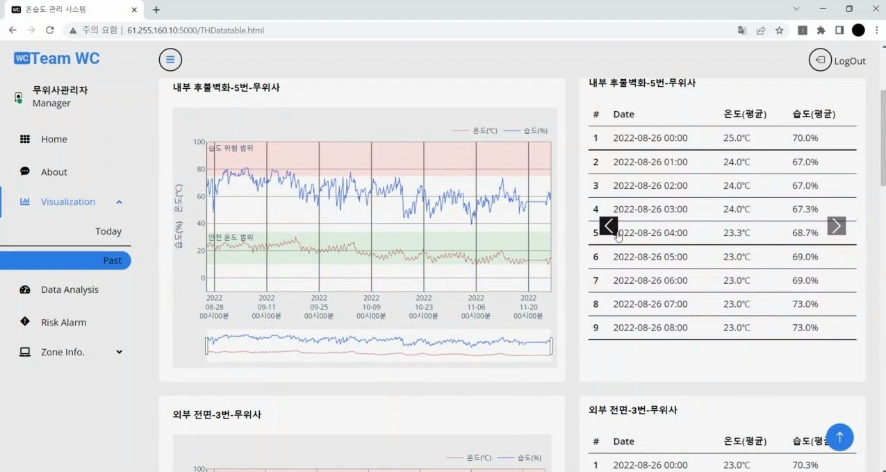
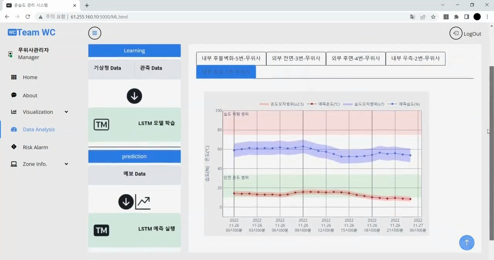
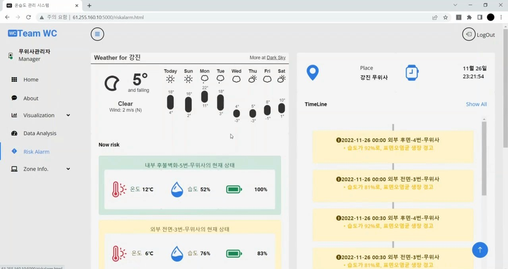

# 기계학습을 활용한 유물공간 온습도 예측관리 시스템

   
  
   
  
   

## 프로젝트 소개
### 프로젝트 동기

유물수명에 가장 많은 영향을 끼치는 요인이 온도, 습도인데, 유물이나 목재, 종이 등을 보관 및 관리하는 공간에서 단순하게 온도, 습도를 테이블형태로만 가져오는 형식이나 수기로 작성하는 형식은 불편하고 비효율적이라고 생각이 들었습니다. 
따라서 유물 공간을 관리하는 사람의 입장에서 더 편리하고 효율적인 시스템을 개발하기 위해 프로젝트를 진행하게 되었습니다.

###  프로젝트 목적
- 온습도를 자동화 저장, 시각화를 통해 직관적인 분석 용이
- 당일의 온습도를 예측하여 예측 온습도를 가지고 위험대비 
- 위험 알림을 통하여 효율적인 관리
- 통합적으로 관리 비용 절감

 

## 기술 스택

| Html | Css | js | BootStrap |
| :--------: | :--------: | :------: | :-----: | 
|   ![html]    |   ![css]    | ![js] | ![bootstrap] |

| Flask | MognoDB | AWS EC2 | Api | Plotly | TensorFlow |
| :--------: | :--------: | :------: | :-----: | :-----: | :-----: | 
|   ![flask]    |   ![mongodb]    | ![ec2] | ![api] | ![plotly] | ![tensorflow] |

 

## 구현 기능

### 10분 간격 온습도 데이터 저장
#### Api를 이용하여 온습도 데이터를 10분 간격으로 저장하고 웹을 업데이트 (자동화)

   
  코드 넣자
   

### 온습도 시각화 기능
#### 관리자가 직관적으로 온습도 데이터의 해석을 가능하게 하는 기능 (직관적인 분석)

   
  
   
  

### 온습도 예측 기능
####  과거에 데이터를 가지고 미래의 온습도를 예측한 결과를 제시하는 기능 (위험 대비)

   
  
   

### 위험 알림 기능
#### 온도나 습도가 안전범위를 벗어났으면 알람을 주는 기능 (효율적인 온습도 관리)

   
  
   
 

 

## 배운 점 & 아쉬운 점
- 온습도를 측정하면서 안전범위에서 벗어나게 되면 그 공간에 온습도를 조절할 수 있는 기계과 연동하여 자동으로 조절했다면 더 효율적인 서비스를 제공할 수 있었는데, 그렇게 하지 못했던 것이 아쉬웠습니다.

- 어려웠던 점은 LSTM 모델을 가지고 온습도를 예측하는 시스템을 개발할 때 공공데이터포털에 과거 기상정보 데이터, 스마트 센서로 가져온 온습도 데이터를 가지고 학습을 진행하였는데 처음에는 성능이 평균 약 83.7%로 좋지 않았던 점이었고, 성능을 높이기 위해 데이터 전처리 및 상관관계를 계산하여 강한 상관관계를 가진 속성만 학습을 진행하는 방법과 minmax 스칼라를 이용하여 표준화시켜 이상치의 영향을 최소화함으로써 성능을 개선하여 온도는 약 평균 95%, 습도는 약 평균 90%로 높일 수 있었다.

 

<!-- Stack Icon Refernces -->

[html]: /readme_img/html.svg
[css]: /readme_img/css.svg
[bootstrap]: /readme_img/bootstrap.svg
[js]: /readme_img/js.svg
[flask]: /readme_img/flask.svg
[mongodb]: /readme_img/mongodb.svg
[ec2]: /readme_img/ec2.svg
[api]: /readme_img/api.svg
[plotly]: /readme_img/plotly.svg
[tensorflow]: /readme_img/tensorflow.svg

